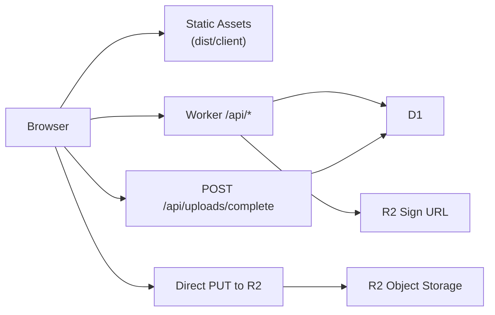

# Cloudflare Architecture

## 1. 结论

当前项目采用单一 Cloudflare Worker 承载整套应用：

- 前端静态资源：Workers Static Assets
- API：Hono on Workers
- 结构化数据：D1
- 图片上传：浏览器直传 R2，Worker 负责签名和落库

这不是“为了上 Cloudflare 而上 Cloudflare”，而是因为这个项目已经是典型的全栈边缘应用：

- 前端是 Vite SPA
- 后端接口数量会持续增长
- 需要账号、任务、复盘、投放记录的持久化
- 需要图片上传和文件元数据管理
- 希望前后端同域、同部署单元、同一套配置来源

## 2. 为什么选 Workers，不选 Pages

对当前项目，Workers 比 Pages 更合适，原因不是性能，而是“控制面和部署面更统一”。

### 2.1 Workers 更贴合这个项目的地方

- 这是一个 `SPA + API + 上传 + 数据库绑定` 的组合，不是纯静态站点。
- 我们需要同一个入口同时处理：
  - SPA 路由
  - `/api/*`
  - D1 绑定
  - R2 绑定
  - 后续可能加入 Access、Rate Limit、审计日志
- Worker-first 模型让 `wrangler.jsonc` 成为单一配置源，避免前端托管和后端函数配置分裂。

### 2.2 为什么不是 Pages

Pages 并不是不能做，而是更适合：

- 纯静态站点
- Jamstack/SSG
- 框架级集成优先
- 更依赖 Pages 分支预览与页面化部署模型的团队

当前项目不需要 Pages 提供的那套抽象，反而更需要：

- 代码式路由
- 绑定式资源管理
- 更直接的 Worker 配置和命令体系

### 2.3 当前项目的 Workers Static Assets 配置

核心配置在 [wrangler.jsonc](/Users/xiaohao-mini/Code/my-ai-web/wrangler.jsonc)：

- `assets.directory = "./dist/client"`
- `assets.not_found_handling = "single-page-application"`
- `assets.run_worker_first = ["/api/*"]`

含义是：

- 静态资源默认直接由资产层返回
- SPA 刷新时返回 `index.html`
- 只有 `/api/*` 进入 Worker

这个配置保留了 SPA 的静态资源优势，也避免把所有前端请求都变成 Worker 调用。

## 3. 为什么选 Hono，不用原生 fetch

`Hono` 不是强依赖，但对这个项目是合理选择。

### 3.1 不用 Hono 的问题

如果全部用原生 `fetch(request, env, ctx)` 手写：

- 路由匹配要自己维护
- 参数校验要自己写
- JSON 错误格式要自己统一
- 中间件、鉴权、日志、错误处理会很快散开

项目一旦超过 5 个以上接口，就会开始出现重复样板代码。

### 3.2 Hono 的收益

- 更清晰的路由组织
- `zod` 校验更自然
- 统一错误处理更简单
- 后续加鉴权中间件、CORS、日志都更顺
- 对 Workers 运行时原生友好

当前实现放在 [worker/index.ts](/Users/xiaohao-mini/Code/my-ai-web/worker/index.ts)。

当前对外 AI 接入也复用了这套 Hono 路由能力：

- `/api/agent/accounts/resolve`
- `/api/agent/tasks/batch`

这组接口需要 Bearer token、`Idempotency-Key`、统一错误格式和审计落库；如果不用路由/中间件抽象，维护成本会更高。

## 4. 系统结构

### 4.1 数据实体

第一版按单人自用设计，核心实体如下：

- `accounts`
  - 账号基础信息
  - 封面图 URL
  - 封面 offset
  - 排序字段
- `tasks`
  - 内容任务主表
  - 归属账号 `account_id`
  - 状态 `待拍 / 已拍 / 已发`
  - 日期、地点、排序
- `task_reviews`
  - 任务复盘
  - `hit_status`
  - `review_data`
- `ad_records`
  - 收入 / 投放流水
  - 归属账号 `account_id`
  - 金额、结算状态
- `assets`
  - R2 文件元数据
  - object key / mime / size / purpose
  - owner_entity_type / owner_entity_id
- `agent_requests`
  - 外部 agent 请求审计
  - `idempotency_key`
  - 请求体 / 返回体
  - `processing / succeeded / failed`

具体 schema 在：

- [migrations/0001_init.sql](/Users/xiaohao-mini/Code/my-ai-web/migrations/0001_init.sql)
- [migrations/0002_agent_requests.sql](/Users/xiaohao-mini/Code/my-ai-web/migrations/0002_agent_requests.sql)

## 5. 上传设计

### 5.1 当前选择

第一版上传采用：

- 前端先请求签名
- Worker 生成 presigned PUT URL
- 浏览器直接 PUT 到 R2
- 上传成功后再调用完成接口落库

### 5.2 这样做的理由

- 文件不经过 Worker 中转，减轻请求体和 CPU 压力
- 上传性能更好
- 更接近大文件和多图上传的长期形态
- 以后更容易扩展成附件系统

### 5.3 当前上传链路

1. 前端调用 `POST /api/uploads/sign`
2. Worker 校验：
   - 文件类型
   - 文件大小
   - 业务用途
3. Worker 返回：
   - `uploadUrl`
   - `objectKey`
   - 上传所需 headers
   - 过期时间
4. 浏览器直接 `PUT` 到 R2
5. 前端调用 `POST /api/uploads/complete`
6. Worker 校验对象存在并写入 `assets`

相关代码：

- 前端调用：[src/lib/api.ts](/Users/xiaohao-mini/Code/my-ai-web/src/lib/api.ts)
- 服务端签名与完成逻辑：[worker/index.ts](/Users/xiaohao-mini/Code/my-ai-web/worker/index.ts)

### 5.4 为什么当前不用 Cloudflare Images

当前业务主要是：

- 账号封面
- 截图
- 后续可能的内容素材

第一版并不急需：

- 多尺寸变体
- 图像加工链路
- 签名查看变体

所以先用 R2 更稳。等后续真需要图像处理能力，再考虑 Cloudflare Images。

## 6. 前端接入策略

### 6.1 从原型状态切到产品状态

这次改造的关键，不只是“加后端”，而是把前端数据源改成真正的 API 驱动。

当前前端已经调整为：

- `App` 统一拉取 `accounts / tasks / ad-records`
- 三个页面都消费同一份真实数据
- 任务、账号、收入记录通过 mutation 更新后端
- 账号封面只把 `createObjectURL` 用在上传前预览，不再作为持久地址
- `accounts / tasks` 在页面 `focus`、可见性恢复和 60 秒可见态间隔下会静默刷新，适合外部 AI 在别处写任务后回到网页查看

入口在 [src/App.tsx](/Users/xiaohao-mini/Code/my-ai-web/src/App.tsx)。

### 6.2 当前页面职责

- [src/pages/Home.tsx](/Users/xiaohao-mini/Code/my-ai-web/src/pages/Home.tsx)
  - 账号切换
  - 账号一览抽屉与账号顺序保存
  - 任务创建、编辑、删除
  - 状态分组与状态推进圆点
  - 显式任务排序模式
  - 复盘保存
  - 账号封面上传
  - 首页账号卡内嵌封面预览
- [src/pages/Archive.tsx](/Users/xiaohao-mini/Code/my-ai-web/src/pages/Archive.tsx)
  - 日历视图
  - 搜索与显式提交
  - 单滚动归档布局
  - 显式任务排序模式
  - 状态筛选展示
  - 归档页任务编辑和删除
- [src/pages/Ads.tsx](/Users/xiaohao-mini/Code/my-ai-web/src/pages/Ads.tsx)
  - 账号维度收入/投放查看
  - 顶部 hero 使用账号截图作为背景
  - 月度筛选
  - 流水记录新增、编辑、删除
  - 收入结算状态快速切换
  - 账号封面上传

### 6.3 当前产品层行为约束

为了避免 UI 和交互反复回退，当前仓库已经固定了几条行为约束：

- `ad_records` 按需懒加载，只在进入 `Ads` tab 后请求
- 页面级使用指引统一由 `PageGuide` 组件承载，并把关闭状态写入 `localStorage`
- 任务排序必须通过显式“排序模式”进入，避免默认拖拽和左滑删除冲突
- `AccountOverviewSheet` 里的账号切换是抽屉内草稿态，点击完成才正式提交到底层页面
- 首页账号大卡采用“氛围背景 + 内层预览”的结构，尽量贴近上传弹窗里的封面预览比例
- 顶部和底部导航已经针对移动端做过压缩，后续改动不要随意把安全区 padding 再拉大

## 7. 安全与配置边界

第一版默认：

- 单人自用
- 不做注册系统
- 不做多租户权限
- 不做复杂 session

但依然把“敏感配置”和“非敏感配置”分开：

- `vars`
  - 非敏感
  - 例如 `R2_ACCOUNT_ID`、`R2_BUCKET_NAME`
- `secret`
  - 敏感
  - 例如 `R2_ACCESS_KEY_ID`、`R2_SECRET_ACCESS_KEY`
  - `AGENT_API_TOKEN`

本地用 `.dev.vars`，线上用 `wrangler secret put`。

## 8. 外部 AI 接入层

当前项目已经有一层单独的 agent-facing API，用来承接 OpenClaw / skills 的只读查询和结构化写入：

- skill 负责自然语言解析、日期换算、追问补全
- Worker 只做结构化校验、账号解析、鉴权、幂等和审计
- 网页端继续是展示与提醒层

这样做的理由：

- 不把浏览器用的 `/api/tasks` 直接暴露给公网 AI
- 不把 LLM 解析逻辑塞进 Worker
- 幂等和审计可以单独演进
- 后续若要加 `/api/agent/commands/ingest`，可以继续复用同一套写入服务

另一个需要明确的边界是构建产物：

- `@cloudflare/vite-plugin` 在 build 过程中可能会临时生成 `dist/my_ai_web/.dev.vars`
- 当前仓库已经通过 [package.json](/Users/xiaohao-mini/Code/my-ai-web/package.json) 的 `build` / `preview` 脚本在退出时自动清理它
- 正式构建和部署不要绕过项目脚本直接复用中间产物

## 8. 当前 API 面

当前已落地接口：

- `GET /api/health`
- `GET /api/accounts`
- `POST /api/accounts`
- `PATCH /api/accounts/:id`
- `GET /api/tasks`
- `POST /api/tasks`
- `PATCH /api/tasks/:id`
- `DELETE /api/tasks/:id`
- `POST /api/tasks/:id/review`
- `GET /api/ad-records`
- `POST /api/ad-records`
- `PATCH /api/ad-records/:id`
- `DELETE /api/ad-records/:id`
- `POST /api/uploads/sign`
- `POST /api/uploads/complete`
- `GET /api/assets/*`

## 9. 非目标

当前方案明确不做：

- SSR
- Pages Functions
- 多用户权限模型
- Cloudflare Images
- Worker 中转上传
- 单独拆成前后端两个仓库

## 10. 后续演进建议

当这个项目继续生长时，建议按下面顺序演进：

1. 增加 `env.staging`
2. 把 `database_id / bucket_name` 从占位值换成真实值
3. 引入 Cloudflare Access 保护后台
4. 把上传完成后的资源与更多实体建立关联
5. 加 `wrangler tail` 日志规范
6. 如果出现图片变体需求，再评估 Cloudflare Images

## 11. 官方资料

- [Wrangler](https://developers.cloudflare.com/workers/wrangler/)
- [Workers Static Assets](https://developers.cloudflare.com/workers/static-assets/)
- [Hono on Workers](https://developers.cloudflare.com/workers/framework-guides/web-apps/more-web-frameworks/hono/)
- [D1](https://developers.cloudflare.com/d1/)
- [R2 Presigned URLs](https://developers.cloudflare.com/r2/api/s3/presigned-urls/)
- [R2 CORS](https://developers.cloudflare.com/r2/buckets/cors/)
